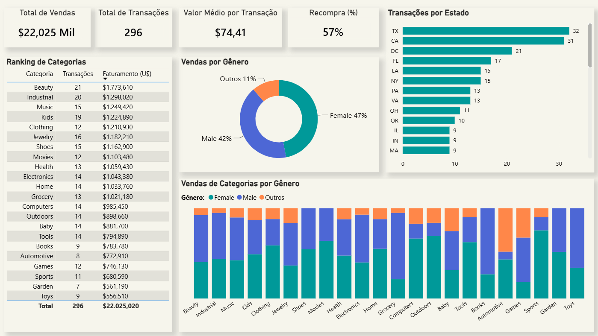
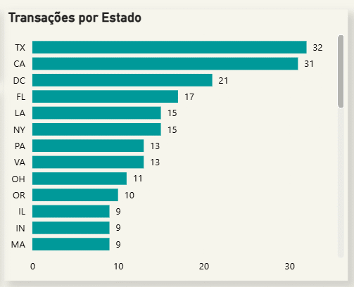
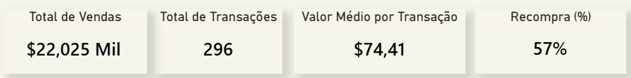
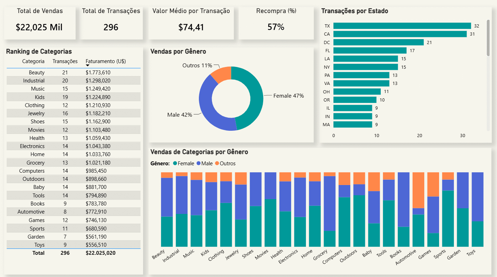

# Power BI | Dashboard Transações E-commerce

Dashboard no Power BI com KPIs e gráficos interativos com dados de transações de um e-commerce dos EUA.

### Objetivo do Projeto: 

### Tecnologias Utilizadas: Power BI, Power Query

### Principais Desafios: 
Tratei a base no Power Query e criei medidas para gerar os KPIs. Para o indicador de recompra, por exemplo, dividi o valor da contagem de clientes únicos pela quantidade total de transações.

Como acessar: "Baixe o arquivo .pbix nesta pasta para visualizar localmente no seu Power BI Desktop".
